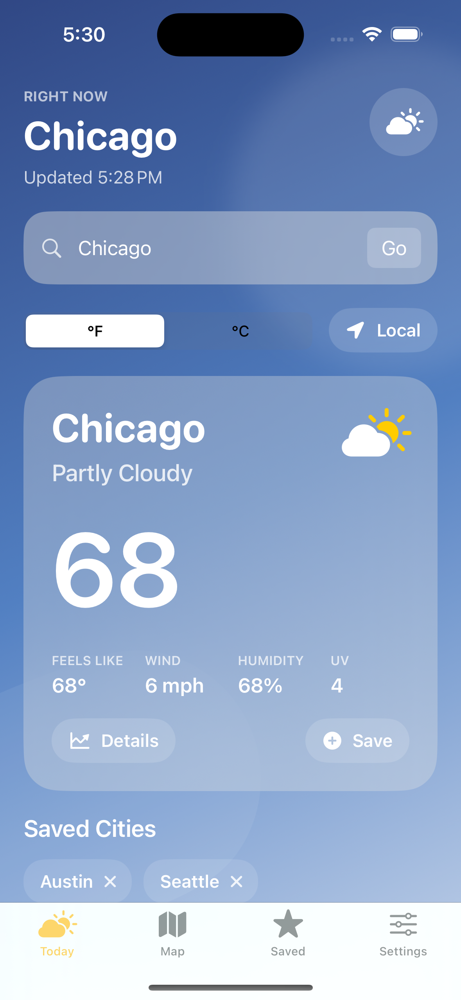
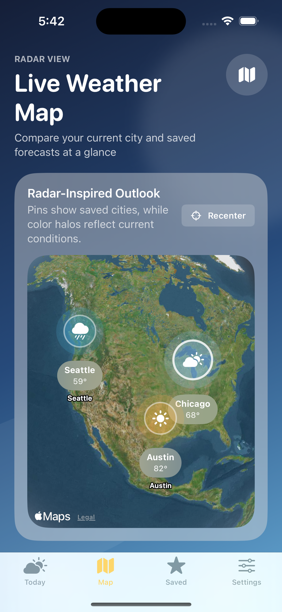

# WeatherNow

WeatherNow is a native SwiftUI weather app for iPhone with a polished forecast dashboard, saved-city workflows, onboarding, search suggestions, and a radar-inspired map screen.

## Screenshots

## What’s inside

- Current conditions with dynamic styling based on weather state.
- Air quality tracking with AQI context, pollutant highlights, and health guidance.
- Alert-style weather guidance for heat, storms, wind, visibility, UV, and rough air conditions.
- Planning guidance that turns forecast data into simple timing, layering, and caution advice.
- App Intents shortcuts for opening saved cities and refreshing forecasts from Siri, Spotlight, and Shortcuts.
- Saved cities with local caching and last-view restore.
- City search with recent searches and live suggestion results.
- A dedicated multi-layer map tab for comparing tracked cities by temperature, rain risk, air quality, and alerts.
- Onboarding that can preload a starter city and preferred units.
- A branded app icon and custom launch screen artwork.

## Tech stack

- SwiftUI for the interface and app flow.
- MapKit for the map experience.
- Core Location for local-weather lookup.
- Open-Meteo for forecast and geocoding data.
- UserDefaults-backed persistence for saved cities, units, recents, and cached snapshots.

## Getting started

1. Open `WeatherNow.xcodeproj` in Xcode.
2. Select the `WeatherNow` scheme and an iPhone simulator or device.
3. Choose your Apple Development Team if you want to run on hardware.
4. Build and run.

No API key is required for the current version.

## Project structure

- `WeatherNow/Views` contains the main screens, including `HomeView`, `WeatherMapView`, `SavedLocationsView`, `SettingsView`, and `OnboardingView`.
- `WeatherNow/Views/Components` contains reusable forecast cards and branded UI pieces.
- `WeatherNow/Models` contains weather models and the `WeatherStore`.
- `WeatherNow/Services` contains the forecast, geocoding, and location integrations.

## Current highlights

- `Today` focuses on the active forecast with richer detail cards and hourly/daily sections.
- `Air Quality` adds AQI context so the app can guide outdoor plans more intelligently.
- `Weather Alerts` surfaces the biggest forecast risks in a quick, readable card instead of leaving them buried in raw numbers.
- `Plan Your Day` helps translate conditions into practical advice instead of just raw numbers.
- `Shortcuts` exposes saved-city and refresh actions to Siri, Spotlight, and the Shortcuts app.
- `Map` presents a radar-inspired comparison of the active city and saved locations with switchable weather layers.
- `Saved` opens cached forecasts fast and refreshes them in the background.
- `Settings` handles units, refresh, onboarding reset, and saved-city cleanup.

## Next ideas

- Real precipitation radar tiles.
- Widgets.
- Additional screenshot coverage for the onboarding and saved-city flows.
